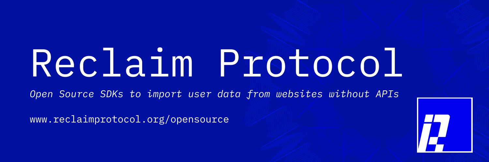

    

        
    

    

        <h3>Reclaim allows your users to bring their data from any website to yours</h3>
        <h4 align="center">
            <a href="https://reclaimprotocol.org">Website</a> |
            <a href="https://docs.reclaimprotocol.org/">Documentation</a> |
            <a href="https://www.reclaimprotocol.org/whitepaper">Whitepaper</a> |
            <a href="https://www.reclaimprotocol.org/ecosystem/">Ecosystem</a> |
            <a href="https://t.me/protocolreclaim">Community</a>
        </h4>
         
    

    

        <h2>Community and Contributing</h2>
        
Please do! Code and non-code contributions are welcome. This project is community-built and fosters collaboration. Contributors are expected to adhere to the <a href="../Code-of-Conduct.md">Code of Conduct</a>.
        

        
Jump into our <a href="https://t.me/protocolreclaim">Community</a> and say Hi! 👋

    

